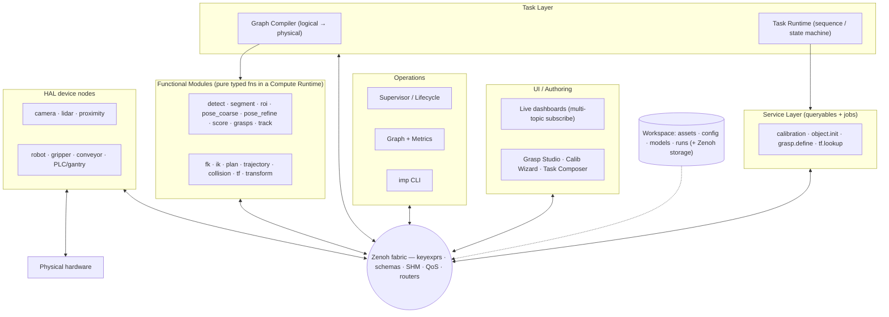
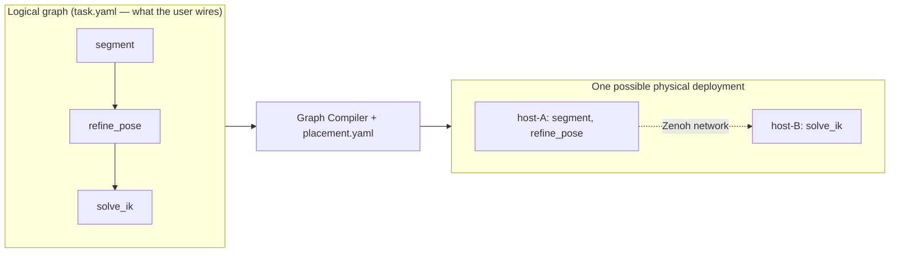
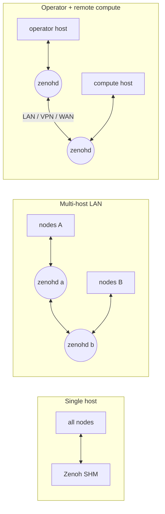
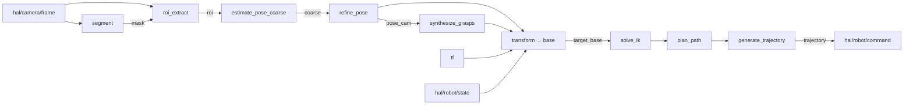
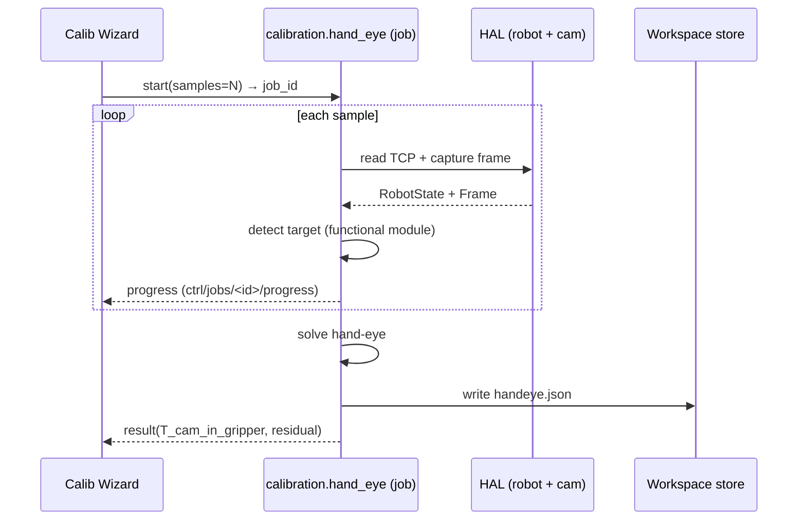
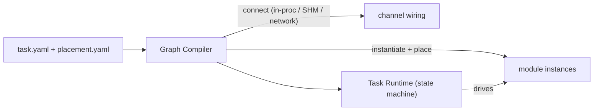
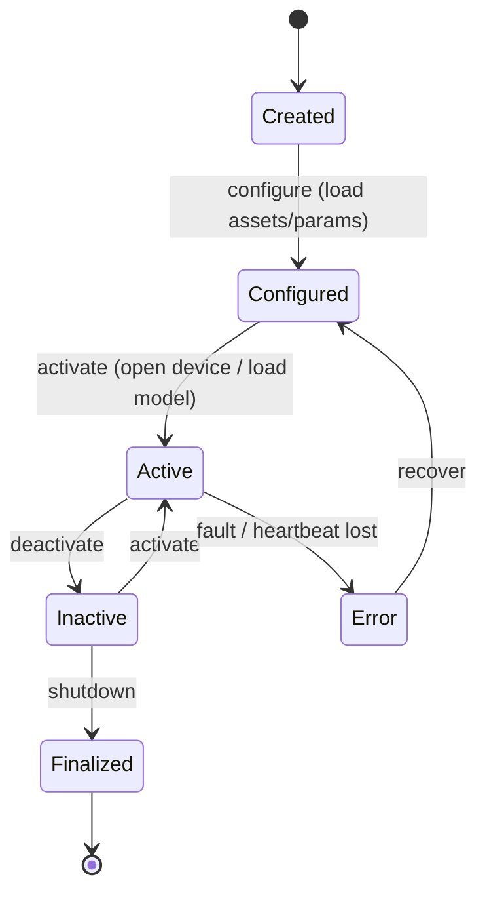
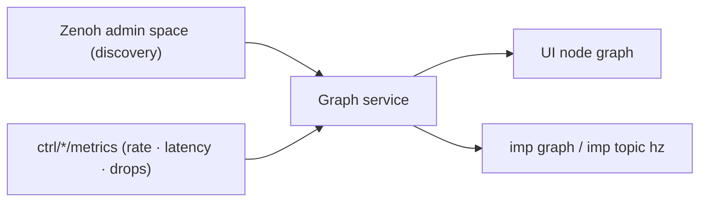
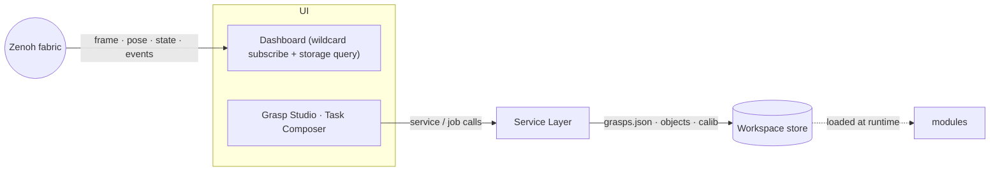

# imp — Topic-Driven Robotics Middleware & No-Code Platform

`imp` is a robotics middleware and platform. Hardware is abstracted behind one layer, every capability
is a typed function, tasks are composable dataflow graphs, and the whole system communicates over a
single fabric — **Eclipse Zenoh**. It runs on **Windows and Linux** as first-class peers, on a single
machine or across any combination of hosts with no code change, exposes a live node graph and a
ROS-style CLI, and ships as a **sealed installable product** with a user-owned workspace and a
documented plugin SDK so integrators can extend it without touching source.

Its flagship application is **Vision-Guided Robotics (VGR)** — see, plan, act on objects — but the same
platform supports any robotics workflow that fits a pub/sub + services + jobs + tasks model
(inspection, palletizing, conveyor sorting, machine tending, visual servo, …).

This is the **complete, standalone specification** — architecture and every peripheral detail
(communication, schemas, services, tasks, lifecycle, introspection, UI, assets, config, compute,
packaging, security, CLI). Everything needed is in this one file.

> **Proprietary** — © DexSent Robotics Pvt Ltd. Ships closed-source; users run and extend it without
> source access.

---

## Contents

1. [Overview](#1-overview)
2. [Why Zenoh — the substrate decision](#2-why-zenoh--the-substrate-decision)
3. [Design principles](#3-design-principles)
4. [System architecture](#4-system-architecture)
5. [Core idea: logical graph vs physical placement](#5-core-idea-logical-graph-vs-physical-placement)
6. [Communication model (Zenoh)](#6-communication-model-zenoh)
7. [Interfaces: one mechanism, four uses](#7-interfaces-one-mechanism-four-uses)
8. [Hardware Abstraction Layer (HAL)](#8-hardware-abstraction-layer-hal)
9. [Functional modules](#9-functional-modules)
10. [Services and jobs](#10-services-and-jobs)
11. [Task layer and the no-code graph](#11-task-layer-and-the-no-code-graph)
12. [Operations: lifecycle, supervisor, introspection](#12-operations-lifecycle-supervisor-introspection)
13. [UI integration](#13-ui-integration)
14. [Workspace, assets and configuration](#14-workspace-assets-and-configuration)
15. [Running the system](#15-running-the-system)
16. [The `imp` CLI](#16-the-imp-cli)
17. [Developing on imp](#17-developing-on-imp)
18. [Compute, threading, rates and performance](#18-compute-threading-rates-and-performance)
19. [Source layout, packaging and distribution](#19-source-layout-packaging-and-distribution)
20. [Production hardening](#20-production-hardening)
21. [Requirement → mechanism traceability](#21-requirement--mechanism-traceability)
22. [From the VGR reference codebase](#22-from-the-vgr-reference-codebase)

---

## 1. Overview

`imp` drives robots that **sense, decide, and act** on the physical world. Its flagship is VGR — detect
an object, estimate a 6-D pose, plan a grasp, execute motion — for pick-and-place, bin-picking,
palletizing, and visual-servo tasks. The same architecture covers any workflow that fits the model.

**Goals:**

- **Hardware-agnostic** — any camera / robot / gripper / PLC / conveyor plugs in behind the HAL.
- **Composable** — a task is a graph of pure functions wired by topics, editable in a no-code UI.
- **Cross-platform** — Windows and Linux are equal first-class targets. Same APIs, same installers,
  same plugin SDK.
- **Topology-agnostic** — fused on one host or split across any combination of hosts (LAN, WAN, edge,
  cloud) by changing placement only — never the graph.
- **Observable** — live node graph with per-topic rates, bag record/replay, ROS-style CLI.
- **Shippable** — sealed installable product; user owns config/assets workspace; devs extend via the
  SDK without source.

**Deployment scenarios `imp` supports — none of them baked into the architecture, just deployment
choices:**

| Scenario | Notes |
|---|---|
| Everything on one Linux PC | Production with or without GPU |
| Everything on one Windows PC | Operator-grade workstation |
| Windows operator + remote Linux GPU host | When perception needs CUDA elsewhere |
| LAN-distributed multi-cell | Shared services across stations |
| Edge runtime + cloud router | Telemetry / storage / replay in cloud |

The architecture is identical in every case. Cross-host distribution and remote GPU are **features
the substrate gives you for free** — they are not requirements that drove the design.

---

## 2. Why Zenoh — the substrate decision

Every feature here (lifecycle, live graph, services, CLI, no-code, cross-platform, optional remote
compute) is downstream of one decision: **the communication substrate**. We evaluated it from
requirements, not from existing code.

| Property `imp` needs | Raw ZMQ + SHM | ROS 2 / DDS | Eclipse Zenoh |
|---|---|---|---|
| Typed topics + schemas | manual | ✅ native | ✅ native |
| Services + long jobs | manual | ✅ + actions | ✅ queryables + jobs |
| Live discovery / introspection | none | ✅ | ✅ admin space |
| Zero-copy on one host | manual SHM | partial | ✅ native SHM |
| Cross-platform (Win / Linux / embedded) | OK | ⚠️ Windows second-class | ✅ first-class everywhere |
| Optional WAN / federated topology | manual relays | ❌ DDS multicast WAN-hostile | ✅ routers, NAT-native |
| Embeddable in a sealed product | OK | ⚠️ heavy to seal | ✅ small, EPL-2.0 / Apache-2.0 |
| **Verdict** | socket library, not middleware | strong on Linux LAN; awkward elsewhere | **fits every row** |

Cross-platform support and optional WAN routing are not *goals* — they are **bonus capabilities** that
drop out of the substrate decision. The architecture would not change if every deployment ran on a
single Linux box.

### Why ZMQ structurally cannot meet this

ZeroMQ is a brilliant **socket library**, not a **middleware**. It moves opaque byte frames between
**explicitly connected** endpoints. It has **no discovery** (hard-coded `IP:port`), **no
typed/queryable data model**, **no durability or "current value"** (a late joiner misses everything),
**no cross-process zero-copy SHM**, **no WAN/NAT routing**, and **no introspection**. Each is either
impossible in ZMQ's model or possible only by re-implementing a middleware — exactly what we are
avoiding.

The decisive evidence is the reference codebase under `reference/`: it **already hand-builds the
workarounds** for ZMQ's gaps, and each is something Zenoh provides natively:

| Existing workaround (in `reference/`) | The ZMQ gap it patches | Zenoh's native answer |
|---|---|---|
| SHM triple buffers for frames (ZMQ carries only `FRAME_READY`, never the image) | no zero-copy large-payload transport | SHM transport carries the payload; one publish |
| `vgr_result_<id>` SHM as a "durable path because large payloads can be missed by the live subscriber" | PUB/SUB drops; no durability/last-value | reliable QoS + storage; query the latest result |
| WebSocket + base64 relay for remote compute ("ZMQ fields ignored in websocket mode") | no WAN/NAT traversal | a `zenohd` router federates any two sides |
| hard-coded ports `5555/5556/5561/5571/5572/8210` across four configs | no discovery; manual N×M wiring | scouting — add a node, it's found |

### Why Zenoh is industrial and proven

ROS 2 abstracts its transport behind the RMW interface; its DDS default hit well-known walls —
discovery that doesn't scale (≈ N² chatter), reliance on multicast (disabled on most enterprise/cloud
networks), and WAN-hostility. The community's answer is **`rmw_zenoh`**, developed with Open Robotics
and now an officially supported RMW and the signposted direction for ROS 2's transport. Zenoh is an
**Eclipse Foundation** project created by **ZettaScale**, led by people who co-authored DDS — built
specifically to fix DDS's transport limits. It spans **microcontrollers (`zenoh-pico`) to data
center**, has commercial support, and `rmw_zenoh` keeps a clean **ROS 2 bridge open** for the future
with no transport rework.

> **The one open alternative, stated plainly:** if we later standardize on Linux and replace the
> in-house motion stack with **MoveIt 2 + tf2**, switch to **ROS 2 with `rmw_zenoh`** — same transport
> benefits, plus the ecosystem. Until then, Zenoh-native is correct. This is the only reversible
> decision here.

---

## 3. Design principles

| Principle | Consequence |
|---|---|
| **One substrate** — all traffic is Zenoh (pub/sub + query + storage + SHM). | No second transport, no hand-rolled relays. |
| **Topics are typed** — every message has a versioned Protobuf schema. | Integration errors caught at the edge, not at runtime. |
| **One interface mechanism** — HAL contracts, module ports, services, jobs all declare their I/O the same way. | Cross-layer consistency; one validation, one introspection, one codegen path. |
| **Functions, not "engines"** — capabilities are pure typed functions. | Unit-testable, reusable, composable. |
| **Logical graph ≠ physical placement** — a task is a graph; placement is deployment config. | Same task runs local or distributed; no-code and production-fast at once. |
| **Manage only what needs it** — lifecycle applies to processes, not pure functions. | Minimal moving parts under supervision. |
| **Workspace is the user's** — code is sealed; config / assets / models are not. | Closed product, open configuration. |
| **Platform-symmetric** — Windows and Linux are equal first-class targets. | Same APIs, same installers, same plugin SDK; `imp doctor` flags anything that diverges. |
| **Docs alongside code** — every crate and every plugin ships a `README.md` and an `examples/` folder. | New users can install, run, and extend without reading internals. |

---

## 4. System architecture



| Layer | Responsibility | Talks via |
|---|---|---|
| **HAL** | Wrap each device; own vendor SDK + real-time loop; standard topic contract | topics only |
| **Functional modules** | Pure typed transforms (perception / spatial / motion) | topics |
| **Services & jobs** | Bounded request/response + long-running cancelable jobs | queryables + topics |
| **Task layer** | Compile + run a task graph; sequence state machine | topics + services |
| **Operations** | Lifecycle, introspection, CLI | Zenoh control keys + admin space |
| **UI** | Visualize topics, trigger services, author assets | subscribe + services |
| **Workspace** | Versioned files + YAML; live state in Zenoh storage | loaded by all layers |

### Operating model — Station → Process → Task → Run

This is the user-facing object model, carried forward from the reference codebase. It is orthogonal to
the architectural layers above: those describe *how* `imp` works; this describes *what users author
and execute*.

| Entity | Definition | Lives in workspace at |
|---|---|---|
| **Station** | one physical cell — cameras, robots, calibration inventory | `stations/<station_id>/` |
| **Process** | one workflow under a station (exactly one task type — e.g. "Bin Picking A") | `stations/<station_id>/processes/<process_id>/` |
| **Task** | a saved configuration under a process — graph + parameters + asset mappings | `…/processes/<process_id>/tasks/<task_id>.yaml` |
| **Run** | one execution instance of a task with its own timeline / state / artifacts | `runs/<run_id>/` |

A Station owns the **physical setup** (which cameras, which robot, calibration). A Process owns the
**workflow context** (gripper, object library, poses, scene, robot asset catalog selection). A Task
owns the **graph + parameters** (which modules, which thresholds, which mappings). A Run owns the
**execution record** (timeline, log, bag, debug artifacts). The CLI, UI, and services all operate on
these four IDs.

---

## 5. Core idea: logical graph vs physical placement

The single decision that makes the system simultaneously **no-code**, **distributable**, and
**production-fast**:

- A capability is a **pure function** with typed inputs/outputs in a registry.
- A **task is a logical dataflow graph** — nodes = functions, edges = typed channels (pure data, YAML).
- The **Graph Compiler** maps that graph onto **physical placement**:
  - edges *inside one process* → direct in-memory calls (zero overhead),
  - edges *between processes on one host* → Zenoh **shared memory** (zero-copy),
  - edges *across hosts* (any topology) → Zenoh **network** transport.

The **same task graph** runs fused on one machine for lowest latency, or split across hosts of any
shape, **by changing placement only — never the graph.** Placement is a deployment concern, not a code
change. This is why no-code composition and production performance stop being in tension.



---

## 6. Communication model (Zenoh)

**Key-expression namespace** (= topics; hierarchical, wildcard-subscribable):

```
imp/<station>/hal/<device>/<signal>     # imp/st1/hal/cam_d405/frame
imp/<station>/perc/<session>/<signal>   # imp/st1/perc/s1/pose
imp/<station>/motion/<plan>/<signal>    # imp/st1/motion/p1/trajectory
imp/<station>/tf                        # frame-graph edges
imp/<station>/svc/<service>             # queryable (request/response)
imp/<station>/ctrl/<node>/<verb>        # lifecycle, heartbeats, metrics
```

Wildcards make fan-in trivial: subscribe `imp/st1/perc/**` for all perception,
`imp/st1/hal/*/state` for every device.

**Schemas — strict, versioned, cross-language.** Messages are defined once in **Protobuf** (proto3) and
code-generated for **Python** (with a Pydantic-style validation wrapper), **Rust** and **C++** (for
perf-critical HAL / control paths). The key carries a `schema=imp.Pose6D/1` attachment; subscribers
**reject on mismatch** — a topic with the wrong schema is treated as a missing topic, not bad data.

```proto
message Header  { uint64 stamp_ns; uint64 seq; string frame_id; string schema; }
message BlobRef { string uri; repeated uint32 shape; string dtype; }   // SHM/file ref, not bytes
message Intrinsics { double fx; double fy; double cx; double cy; repeated double dist; }

message Frame   { Header header; string camera_id; BlobRef rgb; BlobRef depth;
                  Intrinsics intrinsics; double depth_scale_m; }
message Pose6D  { Header header; string object_id;
                  repeated double position_m; repeated double quat_xyzw;
                  double confidence; bool valid; string reject_reason; }
message Grasp   { string grasp_id; double score; repeated double t_obj_gripper; } // 4x4 row-major
message Grasps  { Header header; repeated Grasp candidates; }
message RobotState { Header header; repeated double q; repeated double dq;
                     repeated double tcp_pose; string mode; string active_motion_id; }
message Trajectory { Header header; repeated double t_s; repeated double q_wp; } // flattened waypoints
```

**Big payloads stay out-of-band.** Images, depth, point clouds, and tensors live in Zenoh **shared
memory** (same host) or a blob store; the message carries a `BlobRef {uri, shape, dtype}`, never the
bytes. Zenoh selects SHM automatically when peers are co-located, network transparently when not.

**QoS per channel** (declared, not hand-coded):

| Class | Reliability | Congestion | Priority | History |
|---|---|---|---|---|
| Commands / trajectories | reliable | block | high (control) | keep last N |
| Frames / masks | best-effort | drop (latest-wins) | low | depth 1–2 |
| Poses / state | reliable | drop-oldest | medium | depth 2 |
| Metrics / telemetry | best-effort | drop | lowest | depth 1 |

### Topology examples (deployment-only)

`imp` routes the same keys identically regardless of topology. Three common shapes:



The task graph, keys, schemas, and APIs are identical across all three. SHM is used wherever peers are
co-located.

---

## 7. Interfaces: one mechanism, four uses

> "Can I define IOs for all topics — HAL, jobs, services, modules — in a standard manner with strict
> enforcement?"

**Yes.** Every I/O surface in `imp` is declared the same way: a **name**, a **direction**, a
**Protobuf schema**, a **QoS class**, and (where applicable) a **rate**. Whether it's a HAL device, a
module port, a service request/response, or a job lifecycle, the descriptor is the same shape. The
runtime uses one descriptor for compile-time codegen, runtime validation, introspection, and UI form
generation.

```python
# 1) HAL device — pub/sub topics with schemas
@hal_device(kind="camera")
class RealsenseD405:
    publishes  = {"frame": (Frame, qos="frames", rate_hz=30)}
    subscribes = {}

# 2) Module — typed input/output ports with rate
@module(inputs={"roi": Roi}, outputs={"pose": Pose6D}, rate_hz=10)
def estimate_pose_coarse(roi: Roi, p: CoarseParams) -> Pose6D:
    ...

# 3) Service — request/response schemas
@service("tf.lookup", request=TfLookupRequest, response=TfLookupResponse)
def tf_lookup(req: TfLookupRequest) -> TfLookupResponse:
    ...

# 4) Job — long-running with progress + result schemas
@job("calibration.hand_eye",
     request=HandEyeRequest, progress=HandEyeProgress, result=HandEyeResult)
def hand_eye(req, progress):
    ...
```

Enforcement is layered:

| Layer | What it catches |
|---|---|
| **Compile time** | Codegen produces typed bindings (Rust / Py / C++); type errors fail the build. |
| **Load time** | The schema registry validates that every declared topic / service / job has a known schema and that schema versions are compatible across the deployment. |
| **Runtime (publish)** | Messages serialize through the generated bindings — wrong type is impossible. |
| **Runtime (subscribe)** | The `schema=` attachment is checked on every message; mismatches are dropped and surfaced in `imp doctor`. |
| **Introspection** | The live graph (`imp graph`) shows the schema on every edge; the no-code UI builds parameter forms from it. |

A new field in a Protobuf message is a **schema version bump**; the workspace pins schema versions per
deployment so an upgrade cannot silently change behavior (see §14).

---

## 8. Hardware Abstraction Layer (HAL)

Each device is a **node** (own process, own Zenoh session) holding the vendor SDK and exposing the
standard contract from §7. **No device-specific code exists above HAL.** Perf-critical nodes (camera
capture, robot real-time loop) are typically Rust/C++; the rest can be Python — language choice is per
device, not architectural.

| Topic | Dir | Schema |
|---|---|---|
| `hal/<cam>/frame` | publish | `Frame` (RGB-D as `BlobRef`) |
| `hal/<lidar>/cloud` | publish | `PointCloud` |
| `hal/<prox>/signal` | publish | `Scalar` |
| `hal/<robot>/state` | publish | `RobotState` (q, dq, TCP, mode) |
| `hal/<robot>/command` | subscribe | `MotionCommand` (joints / TCP / trajectory) |
| `hal/<gripper>/state` / `command` | pub / sub | `GripperState` / `GripperCommand` |
| `hal/<conveyor>/state` / `command` | pub / sub | `Conveyor*` |
| `hal/<plc>/io` | pub / sub | `IO` |

A new device = one new node implementing the contract; nothing else changes. The **robot HAL node owns
the deterministic real-time loop** and accepts a whole `Trajectory`, so jitter in upper layers cannot
affect execution timing.

**Built-in HAL drivers** (each shipped as a separate plugin crate under `hal/` — see §19):

| Kind | Plugin | Hardware |
|---|---|---|
| Camera | `camera-realsense` | Intel RealSense D435i / D405 (RGB-D) |
| Camera | `camera-basler-gige` | Basler GigE (RGB, industrial) |
| Camera | `camera-flir-gige` | FLIR Blackfly GigE (RGB + thermal) |
| Camera | `camera-uvc` | Generic USB UVC webcam |
| Robot | `robot-mujoco-ur5e` | UR5e in MuJoCo (sim) |
| Robot | `robot-ur-rtde` | Universal Robots e-Series (RTDE) |
| Robot | `robot-franka-fr3` | Franka Emika FR3 (libfranka) |
| Robot | `robot-xarm` | xArm 7-DOF |
| Gripper | `gripper-onrobot` | OnRobot parallel-jaw |
| Gripper | `gripper-robotiq` | Robotiq 2F / Hand-E |
| Gripper | `gripper-franka-hand` | Franka Hand |
| I/O | `plc-modbus` | Modbus TCP PLC / IO |

```python
@hal_device(kind="camera")
class RealsenseD405(CameraNode):
    def configure(self, cfg):  ...   # lifecycle: open SDK, load intrinsics
    def activate(self):        ...   # start capture loop → publish hal/<id>/frame
    def deactivate(self):      ...   # stop loop, release device
```

---

## 9. Functional modules

A module is a **pure typed function** plus the interface descriptor from §7. The **Compute Runtime**
does subscribe → validate → call → publish; the function stays pure and unit-testable. The existing
motion code (Pinocchio FK/IK, Coal collision) and perception modules (MegaPose, PPF-ICP, template/SIFT,
cuboid) from the VGR reference are **wrapped as modules**, not rewritten.

```python
@module(inputs={"roi": Roi}, outputs={"pose": Pose6D}, rate_hz=10)
def estimate_pose_coarse(roi: Roi, p: CoarseParams) -> Pose6D:
    ...
    return Pose6D(...)
```

### Abstract module groups

| Group | Modules (in → out) |
|---|---|
| **Perception** | `detect` (Frame→Detections), `segment` (Frame→Mask), `roi_extract` (Frame+Mask→Roi), `estimate_pose_coarse` (Roi→Pose6D), `refine_pose` (Pose6D+Roi→Pose6D), `score_pose` (Pose6D→Pose6D w/ `valid`/`reject_reason`), `synthesize_grasps` (Pose6D+template→Grasps), `track` (Pose6D stream→smoothed), `fuse_multiview` (Pose6D[cam-a]+Pose6D[cam-b]+…→fused Pose6D) |
| **Spatial** | `tf` (frame graph; **hand-eye is just an edge**), `transform` (Pose6D[cam]+tf+RobotState→PoseTarget[base]) |
| **Motion** | `solve_fk` (JointState→Pose6D), `solve_ik` (PoseTarget+seed→JointSolution), `plan_path` (JointSolution+world→Path), `generate_trajectory` (Path→Trajectory), `check_collision` (Path+world→validity), `grasp_feasibility` (Grasps+gripper+world→ranked Grasps) |

Camera→base conversion is no longer a special case in an orchestrator — it is the ordinary `transform`
module reading a `tf` edge.

### Concrete built-in modules (carried forward from the VGR reference)

Each ships as a separate plugin crate under `modules/` (see §19). Algorithms are kept; the ZMQ
plumbing around them is replaced with imp's topic contract.

| Plugin | Implements | Backend / origin |
|---|---|---|
| `perception-yolo` | `detect` + `segment` | YOLOv8 / v26 (`object_proposals` in reference) |
| `perception-megapose` | `estimate_pose_coarse` + `refine_pose` | MegaPose6D (RGB-D) |
| `perception-ppf-icp` | `estimate_pose_coarse` + `refine_pose` | Point-Pair-Feature + ICP (model-based, fast) |
| `perception-template` | `estimate_pose_coarse` | Depth-aware template matching with scale/rotation search |
| `perception-template-sift` | `estimate_pose_coarse` | SIFT-based template matching variant |
| `perception-feature` | `detect` | ORB / SIFT descriptor matching |
| `perception-blob` | `detect` | Blob / contour detection from binary masks |
| `perception-cuboid` | `estimate_pose_coarse` + `track` | 6-D cuboid pose with temporal filtering |
| `perception-opt-sift` | `detect` | Optimized SIFT (perspective-invariant) |
| `perception-track` | `track` | Kalman-style pose smoothing |
| `perception-fusion` | `fuse_multiview` | Multi-camera pose fusion |
| `perception-preview` | passthrough | Frame preview / stream module |
| `motion-pinocchio` | `solve_fk` + `solve_ik` + `jacobian` | Pinocchio URDF loader + IK solver |
| `motion-coal` | `check_collision` | Coal + Pinocchio collision queries |
| `motion-ompl` | `plan_path` | OMPL RRT / RRT-Connect / Bi-RRT |
| `motion-cartesian` | `plan_path` | Cartesian linear planner |
| `motion-path-processor` | `plan_path` post-step | Shortcutting + smoothing |
| `motion-ruckig` | `generate_trajectory` | Ruckig jerk-limited motion profile |
| `motion-grasp-library` | `synthesize_grasps` + `grasp_feasibility` | Grasp candidate DB + friction-cone feasibility for parallel-jaw / vacuum |
| `spatial-tf` / `spatial-transform` | frame graph + transform | (own implementation) |

Module parameters (selection mode `top_k` / `lowest_z`, `min_confidence`, area-ratio gates, warm-up
frames, safety margins, `mesh_scale` / `mesh_units`, depth filtering) are declared on the module's
parameter type (§7) and surfaced in the no-code UI as typed form fields.

**Pick pipeline as a topic graph:**



---

## 10. Services and jobs

Two interaction styles, both first-class, both declared with the same descriptor as §7:

- **Service** = synchronous **Zenoh queryable** for bounded ops (`grasp.define`, `tf.lookup`, `asset.get`).
- **Job** = long-running op (hand-eye sampling, a calibration sweep, a full task run): `POST svc/<name>`
  returns a `job_id`; progress streams on `ctrl/jobs/<id>/progress`; the result is queryable at
  `svc/jobs/<id>`. This is the equivalent of a ROS *action* — cancelable, monitorable, time-bounded.

| Op | Style | Persists |
|---|---|---|
| `calibration.intrinsics` | job | `calibration/intrinsics.json` |
| `calibration.hand_eye` | job | `calibration/handeye.json` |
| `calibration.tcp` | service | `calibration/tcp.json` (tool mount + custom TCP) |
| `calibration.target` | service | `calibration/target.json` (ArUco / checkerboard def) |
| `calibration.samples` | job | `calibration/samples.json` (raw sample data for re-solve) |
| `object.init` (ingest CAD/mesh) | job | `objects/<id>/…` (mesh + ROI + templates) |
| `grasp.define` (Grasp Studio backend) | service | `objects/<id>/grasps.json` |
| `scene.define` (obstacles + collision meshes) | service | `…/scenes/<id>/scene.yaml + obstacles/` |
| `pose.save` / `pose.list` (named poses: home / capture / place / …) | service | `…/poses/<name>.yaml` |
| `tf.lookup`, `asset.get` | service | — |
| `run.start` / `run.stop` / `run.list` / `run.timeline` | service | `runs/<id>/…` |
| `task.validate` / `task.run` / `task.stop` | service / job | — / `runs/<id>/` |
| `robot.dt.evaluate` (digital twin: FK, collision, reachability check) | service | — |

**Hand-eye calibration as a job:**



---

## 11. Task layer and the no-code graph

A task is the **logical graph** from §5 plus a high-level **sequence** (state machine). The **Graph
Compiler** validates schemas + wiring and produces placed module instances; the **Task Runtime** drives
the sequence and reacts to `reject_reason` and motion/job events.

```yaml
task:
  id: pick_place_barrel
  assets: { object: barrel, robot: ur5e, gripper: pj_a, calibration: st1 }
  graph:
    nodes:
      - { id: cam,    fn: hal.camera,                 device: cam_d405, rate_hz: 30 }
      - { id: seg,    fn: perc.segment,               model: yolo26_seg.pt, rate_hz: 10 }
      - { id: roi,    fn: perc.roi_extract }
      - { id: coarse, fn: perc.estimate_pose_coarse,  backend: megapose }
      - { id: refine, fn: perc.refine_pose }
      - { id: grasps, fn: perc.synthesize_grasps,     template: barrel.grasps }
      - { id: tobase, fn: spatial.transform,          target_frame: base }
      - { id: ik,     fn: motion.solve_ik }
      - { id: plan,   fn: motion.plan_path,           planner: rrt_connect }
      - { id: traj,   fn: motion.generate_trajectory, profile: scurve }
      - { id: arm,    fn: hal.robot,                  device: ur5e }
    edges: [[cam.frame,seg.frame],[cam.frame,roi.frame],[seg.mask,roi.mask],
            [roi.roi,coarse.roi],[coarse.pose,refine.pose],[refine.pose,grasps.pose],
            [refine.pose,tobase.pose],[grasps.grasps,tobase.grasps],[tobase.target,ik.target],
            [ik.solution,plan.goal],[plan.path,traj.path],[traj.traj,arm.command]]
  sequence: [acquire, detect_pose, select_grasp, approach, grasp, lift, place]

placement:                      # deployment-only; the graph above never changes
  host_a: [seg, coarse, refine]                            # e.g. a GPU box, if you have one
  host_b: [cam, roi, grasps, tobase, ik, plan, traj, arm]  # e.g. operator station
```

`host_a`, `host_b` are just labels mapped to actual hosts in `deployment.yaml`. A single-host
deployment puts everything on one label and is the default.

**Tasks are authored modularly — the platform ships no fixed task catalog.** A task is just a
YAML graph + sequence over the registered modules (§9), services (§10), and HAL nodes (§8). New
tasks are created by:

- composing existing modules into a new graph (no code, in YAML or the Task Composer UI),
- registering a new module via the SDK if a missing capability is needed (§17), or
- adding a new service / job if the task needs a new bounded op or long-running action.

The set of tasks grows over time. Nothing in the runtime knows the list of tasks ahead of time —
the Task Runtime loads any valid task graph that compiles.

**No-code direction:** the **Task Composer** UI edits the YAML; adding a capability = registering a
function; building a task = drawing edges. Placement is a separate deployment view. No
orchestration code is written per task.

**Starter task templates** (shipped under `examples/` to seed new workspaces — **not a closed list**;
add freely):

| Template | Sequence | Notes |
|---|---|---|
| `bin-picking-ppf` | acquire → detect → ppf-icp → grasp-select → approach → grasp → lift → place | Model-based, fast |
| `bin-picking-megapose` | acquire → detect → megapose-coarse → megapose-refine → grasp-select → approach → grasp → lift → place | Network-based, robust to clutter |
| `dummy-testing` | capture → evaluate-scene → report | No motion; scene + vision validation |
| `follow-object` | detect → track → approach → servo (loop) → stop | Visual servo / dynamic tracking |
| `palletizing` | detect → plan-layer → pick → place-on-pallet → next-cell (loop) | Layer-aware stacking |
| `pick-place` | acquire → detect → ik → plan → approach → grasp → lift → place | Generic parameterizable pick-place |
| *(your task here)* | … | author in YAML or Task Composer; no core change needed |

### Task as a composable unit

For tasks to compose cleanly, each task is itself a **sealed unit** with a typed contract:

- **Inputs** declared at the task boundary (e.g. `object_id`, `target_pose`, `max_attempts`) —
  validated against the same Interface descriptor (§7).
- **Outputs** declared at the task boundary (e.g. `final_pose`, `success`, `reject_reason`) —
  same.
- **Sub-tasks** — a task graph node can itself be `fn: task.<other_task_id>`, so a higher-level
  task (e.g. `palletize_full_pallet`) composes lower-level tasks (`pick_one_box` ×N) without
  flattening their graphs.
- **Lifecycle events** — every task emits a uniform `task.started` / `task.stage_changed` /
  `task.succeeded` / `task.failed(reason)` event stream on `ctrl/runs/<id>/events`, so the UI,
  CLI, and other tasks all see the same signals.

This is what "modular" means here: a task is a typed callable like a module — it just happens to be
composed of other callables. New tasks slot in without changing the runtime, the CLI, or the UI.



---

## 12. Operations: lifecycle, supervisor, introspection

### Lifecycle (managed only where required)

Managed at the **process boundary** — HAL nodes, the module host, the service host, the task runtime.
Pure functions inside a host are governed by that host, not individually supervised. A component opts
in with `managed: true`.



The **Supervisor** reads a **deployment manifest**, brings components up in dependency order, watches
heartbeats on `ctrl/<node>/health`, restarts with backoff, and shuts down in reverse:

```yaml
deployment:
  id: station-1
  hosts:
    host_a: { os: linux, role: compute }       # plain labels — any OS, any role
    host_b: { os: any,   role: operator }
  components:
    - { id: cam_d405,     kind: hal.camera,   managed: true, host: host_b, autostart: true, restart: on-failure }
    - { id: ur5e,         kind: hal.robot,    managed: true, host: host_b, restart: on-failure }
    - { id: perception,   kind: module-host,  managed: true, host: host_a, gpu: optional, restart: on-failure }
    - { id: services,     kind: service-host, managed: true, host: host_b }
    - { id: task-runtime, kind: task.runtime, managed: true, host: host_b, depends_on: [cam_d405, ur5e, perception] }
  policies: { heartbeat_s: 1, restart_backoff_s: [1,2,5,10], shutdown_order: reverse }
```

### Introspection — the live data-flow map

Zenoh's **admin space** already enumerates sessions, publishers, and subscribers. Each module
additionally reports `rate_hz / bytes_s / latency / queue_depth / drops` on `ctrl/<node>/metrics`. A
**Graph service** joins discovery + metrics into a `GraphSnapshot` that the UI draws as a node graph
and the CLI prints — the `rqt_graph` + `ros2 topic hz` experience, built in.



```python
class TopicStat(BaseModel):
    topic: str; schema: str; rate_hz: float; bytes_per_s: float
    msg_count: int; drops: int; last_stamp_ns: int

class NodeStat(BaseModel):
    node: str; state: str                       # created|configured|active|inactive|error
    publishes: list[str]; subscribes: list[str]
    cpu_pct: float; gpu_pct: float | None; queue_depth: dict[str, int]

class GraphSnapshot(BaseModel):
    stamp_ns: int; nodes: list[NodeStat]; topics: list[TopicStat]
```

---

## 13. UI integration

> "Is the UI planned efficiently, and does all data flow via topics? Or is there something better?"

**Confirmed:** all live data flows to the UI via topics, all actions go via services/jobs, and any
state that needs to be available on UI startup is read from Zenoh storage. The UI owns **no logic** —
it is a fan-in subscriber, a service trigger, and a storage reader.

### Data paths into the UI

- **Live streams** — one wildcard subscription (`imp/<st>/perc/**`, `imp/<st>/hal/*/state`) drives
  every panel; the fabric handles fan-in. Schemas are known, so the UI knows how to render every
  payload.
- **Late-joiner state** — at startup the UI queries Zenoh storage for current calibration, last pose,
  robot state, etc., so panels render instantly without waiting for the next publish.
- **Service / job triggers** — buttons call `calibration.*`, `grasp.define`, `object.init`,
  `task.run`. Job progress streams on `ctrl/jobs/<id>/progress`.
- **Authoring → store → runtime** — Grasp Studio writes through `grasp.define` to
  `objects/<id>/grasps.json`, consumed by `synthesize_grasps` at runtime. Same loop for Calibration
  Wizard and Task Composer.

### Browser, native, embedded — all the same way

Native (Tauri / Electron / Qt) and CLI UIs use the Zenoh Rust/Python SDK directly. **Browser UIs** use
either `zenoh-ts` (the official TypeScript binding) or a `zenoh-bridge-rest` / `zenoh-bridge-ws`
running alongside the runtime. Either way the UI subscribes to the **same keys** as everything else —
no parallel HTTP API to keep in sync, no UI-specific paths in the runtime.

### Optional: digest topics for very high-rate streams

For channels like raw camera frames (30 Hz) or joint state (1 kHz), the UI subscribes to a
**downsampled digest** publisher (`imp/<st>/ui/<panel>/digest`) instead of the raw topic. The digest
is a thin module — pure topic-in / topic-out, declared like any other module — that can live anywhere
in the deployment. This keeps UI bandwidth bounded without changing the producer or the consumer
shape.

### Why this is the right shape

- **No second API** to keep in sync with the bus.
- **The UI sees exactly what the CLI and other subscribers see** — no privileged channel; what you
  debug in CLI is what the UI renders.
- **A new module or topic appears in the UI automatically** (schema-driven panels), without UI code
  changes.
- **Topology-agnostic** — the UI does not know or care whether the publisher is in-proc, on the same
  host, or across a WAN router.

### UI surfaces (carried forward from the VGR reference)

The reference shipped a substantial UI; every surface there carries forward as a named view in
`imp-ui`. None of them are "the UI" — they are distinct authoring or monitoring tools that talk to
the same bus.

| Surface | Purpose | Talks via |
|---|---|---|
| **Dashboard** | Live overview: station status, robot mode, last pose, run progress | wildcard subscribe |
| **Operator console** | Run / pause / stop tasks; manual commands; pendant-style controls | service calls |
| **RobotViz** | Browser 3-D view of the robot + scene (URDF + meshes via Three.js + OCCT) | subscribe `hal/<robot>/state`, `tf`, scene |
| **Task Composer** | No-code task graph editor (nodes = modules, edges = topics) | reads `task.yaml`, writes via `task.save` |
| **Calibration Wizard** | Step-through for intrinsics → target → hand-eye → TCP | calls `calibration.*` jobs |
| **Grasp Studio** | Place / score / save grasp sites on an object mesh | calls `grasp.define`; reads `objects/<id>/grasps.json` |
| **Gripper Studio** | Define a gripper (URDF + grasp sites + frames + safety margins) | reads / writes `gripper/` assets |
| **Object Browser** | Browse the object library (mesh, templates, grasps, lighting variants) | reads `objects/<id>/…` |
| **Pose Library Editor** | Jog robot, capture, name and save poses (home / capture / place / calib / mega / …) | service `pose.save`; reads `poses/<name>.yaml` |
| **Scene / Frame Editor** | Edit obstacles and the frame graph for a task (visual gizmo) | reads / writes `scenes/<id>/scene.yaml`; `spatial.tf` edits |
| **Gizmo Editor** | Generic 3-D transform widget reused by Scene / Grasp / Frame editors | — |
| **Perception Debug** | Overlays: detections, masks, pose axes, depth quality, reject reasons | subscribe `perc/**` |
| **Run Monitor** | Per-run timeline, event log, motion plot, debug images | subscribe `ctrl/jobs/<id>/progress`; reads `runs/<id>/…` |
| **Asset Manager** | Browse / import / export workspace assets (URDFs, meshes, models, calibration) | reads workspace store |



---

## 14. Workspace, assets and configuration

The product is sealed; the **workspace** is the user's. Everything is referenced by **id**, never
hard-coded. Small live state (current calibration, registry, last pose) is also kept in **Zenoh
storage** for live queries. The layout mirrors the operating model from §4: **Station → Process →
Task → Run**.

```
workspace/
├── stations/
│   └── <station_id>/
│       ├── station.yaml                    # name, location, cameras + robots present
│       ├── hardware.yaml                   # device id → driver + topic + rate (per station)
│       ├── calibration/
│       │   ├── intrinsics/<cam_id>.json    # fx, fy, cx, cy, distortion, resolution
│       │   ├── handeye.json                # eye-in-hand (T_gripper_camera) or eye-to-hand
│       │   ├── tcp.json                    # tool mount + custom TCP + flange chain
│       │   ├── target.json                 # ArUco / checkerboard target definition
│       │   └── samples.json                # raw calibration samples (re-solvable)
│       └── processes/
│           └── <process_id>/
│               ├── process.yaml            # name, task_type, gripper id, robot id
│               ├── gripper/                # URDF + visual/collision meshes + frames + grasp sites
│               ├── robot/                  # URDF / MJCF + visual/collision meshes
│               ├── objects/<object_id>/    # mesh (OBJ/STL/PLY) + templates/ + grasps.json + lighting variants + pick_contacts.json
│               ├── poses/<name>.yaml       # named poses (home / capture / place / calib / mega / up_int / …)
│               ├── bin/<bin_id>.yaml       # bin / ROI geometry (origin + dims + frame)
│               ├── scenes/<scene_id>/      # obstacles + collision geometry per scene
│               │   ├── scene.yaml
│               │   └── obstacles/          # mesh files referenced by scene.yaml
│               └── tasks/<task_id>.yaml    # logical graph + sequence + asset mappings + params
├── models/                                 # *.pt trained networks (segment, detect, megapose, …)
├── deployments/<deployment_id>/
│   ├── deployment.yaml                     # components, hosts, lifecycle policy
│   └── placement.yaml                      # node → host mapping (deployment-only)
├── runs/<run_id>/
│   ├── meta.json                           # task_id, process_id, station_id, start/stop, status
│   ├── timeline.json                       # structured event log (state transitions, vision results, motion events)
│   ├── log.txt                             # human-readable log
│   ├── bag/                                # Zenoh bag of all subscribed topics (frames, poses, state, …)
│   └── artifacts/                          # debug images, plots, exported reports
└── trash/<timestamp>/                      # auto-archived old configs (overwrite-on-save backup)
```

### Asset categories (one row = one folder kind under a process)

| Category | Format | Produced by | Consumed by |
|---|---|---|---|
| Robot | URDF / MJCF + meshes | import / robot asset catalog (§19) | `motion-pinocchio`, `motion-coal`, RobotViz |
| Gripper | URDF + meshes + frames.json + grasp sites | Gripper Studio | `motion-grasp-library`, RobotViz |
| Object | OBJ / STL / PLY + `metadata.json` + `templates/` + `grasps.json` + `pick_contacts.json` + lighting variants (`*.lighting_lab.json`) | `object.init` job + Object Browser | perception modules, `motion-grasp-library`, RobotViz |
| Pose | YAML / JSON (`q[]` or `tcp_pose`) | Pose Library Editor | tasks (motion targets) |
| Bin | YAML (origin + dimensions + frame_id) | Frame / Scene editor | bin-picking task ROI |
| Scene | `scene.yaml` + `obstacles/` (meshes) | Scene editor | `motion-coal`, RobotViz |
| Task | YAML (graph + sequence + params + mappings) | Task Composer / hand-edit | Graph Compiler, Task Runtime |
| Calibration | JSON (intrinsics / handeye / tcp / target / samples) | `calibration.*` jobs | `spatial-tf`, perception |
| Trained model | `.pt` | offline training pipeline (see `tools/`, §17) | perception modules |

### Config kinds — all schema-validated, version-pinned

`station.yaml`, `process.yaml`, `hardware.yaml`, `tasks/<id>.yaml`, `scenes/<id>/scene.yaml`,
`deployment.yaml`, `placement.yaml`. **Schema + asset versions are pinned per deployment** so an
upgrade cannot silently change behavior.

```yaml
# stations/st1/hardware.yaml
devices:
  - { id: cam_d405, kind: camera,  driver: camera-realsense, topic: hal/cam_d405, rate_hz: 30, depth: true }
  - { id: ur5e,     kind: robot,   driver: robot-ur-rtde,    command: hal/ur5e/command, state: hal/ur5e/state, state_hz: 125 }
  - { id: pj_a,     kind: gripper, driver: gripper-onrobot }
```

### Versioning + rollback

Every config write through the UI or a service is **atomic with a timestamped backup** to
`workspace/trash/<timestamp>/` (carries forward the reference's `trash/` convention). `imp deploy
diff` shows pending changes vs. the running deployment; `imp deploy rollback` restores the most
recent backup. No silent overwrites.

### Workspace location

Default `~/.imp/workspace` on Linux, `%USERPROFILE%\.imp\workspace` on Windows; overridable with
`IMP_WORKSPACE` or `imp --workspace …`. The workspace is fully portable between OSes — no
host-specific paths or binaries inside it. A workspace can be zipped and moved between machines.

**Runtime integration:** at startup the loader validates each YAML against its schema, resolves asset
ids from the store, builds the HAL node set and the task module graph (placed per `placement.yaml`),
and starts the rate-scheduled runtime. Config is the single source of truth — the same graph YAML
drives both the runtime and the no-code UI.

---

## 15. Running the system

### Default — single host

```bash
imp up                              # Supervisor reads deployment.yaml; nodes up in dep order
imp task run pick_place_barrel
```

This is the default and works identically on Windows and Linux.

### Optional — multiple hosts

Run an `imp router` on each host (a thin wrapper over `zenohd`), then start each host with
`--only <host-label>`. Hosts discover each other; the task graph, keys, and APIs are unchanged.

```bash
# host-a
imp router up
imp up --only host_a

# host-b
imp router up
imp up --only host_b
imp task run pick_place_barrel
```

The hosts can be any combination of Windows and Linux machines on a LAN, or federated over a WAN /
VPN — Zenoh's routers handle NAT and the SHM path is used wherever peers are co-located. This is
**one of several deployment topologies, not the default**.

`imp up` / `imp down` are the lifecycle entry points; the Supervisor handles dependency-ordered
startup, heartbeats, restart-on-failure with backoff, and reverse-order shutdown.

---

## 16. The `imp` CLI

A thin client over the same Zenoh planes the UI uses, so they always agree. One binary, on PATH via
the installer (`imp.exe` on Windows, `imp` on Linux).

| Command | Does |
|---|---|
| `imp up` / `imp down` | start / stop the deployment via the Supervisor |
| `imp station list` / `imp station info <id>` | list stations / inspect (cameras, robots, calibration) |
| `imp process list <station>` / `imp process info <id>` | list processes under a station / inspect |
| `imp task list <process>` / `imp task validate <id>` / `imp task run <id>` / `imp task stop <id>` | wiring + schema check, run, stop a task |
| `imp run list <task>` / `imp run show <id>` / `imp run timeline <id>` / `imp run open <id>` | list / inspect / open per-run artifacts |
| `imp node list` / `imp node info <id>` | list components / inspect lifecycle, pubs/subs, CPU/GPU |
| `imp lifecycle <activate\|deactivate\|restart> <id>` | drive a managed node's FSM |
| `imp topic list` / `imp topic echo <ke>` / `imp topic hz <ke>` / `imp topic bw <ke>` | discover & measure any channel (wildcards ok) |
| `imp graph [--export svg]` | render the live node graph with rates |
| `imp service list` / `imp service call <name> <json>` | list services / invoke one |
| `imp job list` / `imp job <id>` / `imp job cancel <id>` | track / cancel jobs |
| `imp calib intrinsics <cam>` / `imp calib hand-eye` / `imp calib tcp` / `imp calib target` | run a calibration job from the CLI |
| `imp pose list` / `imp pose save <name>` / `imp pose goto <name>` | named-pose library ops |
| `imp object list` / `imp object init <mesh>` / `imp grasp define <object>` | object + grasp asset ops |
| `imp scene list` / `imp scene edit <id>` | scene / obstacle ops |
| `imp bag record <kes>` / `imp bag play <bag>` | record a session / replay for offline eval |
| `imp param get <node> <key>` / `imp param set <node> <key> <val>` | inspect / tune module params live |
| `imp asset list` / `imp asset info <id>` | browse workspace assets |
| `imp deploy show` / `imp deploy diff` / `imp deploy apply` / `imp deploy rollback` | inspect / diff / apply / roll back deployment + placement |
| `imp router up` / `imp router down` | start / stop the local Zenoh router (multi-host only) |
| `imp doctor` | health sweep: heartbeats, schema drift, dead/slow topics, clock skew, OS-symmetry checks |
| `imp version` | print runtime + SDK + schema versions |

**Debug / eval loop:** `imp bag record` a real run → `imp bag play` it into perception with hardware
off → diff poses → `imp param set` to tune → re-run. `imp doctor` and `imp topic hz` catch the usual
failures (a slow stage, a topic with no subscriber, a schema-version drift).

---

## 17. Developing on imp

Two audiences, both supported by the same SDK and the same plugin mechanism.

### Operator
Installs `imp-runtime` (§19). Edits the workspace YAML, runs `imp up` / `imp task run …`, uses the
UI. Never sees source.

### Plugin / task developer
Installs `imp-runtime` + `imp-sdk` (Python or Rust). Writes plugins **against the SDK only** and
loads them as separate wheels / crates via entry points. Still never sees `imp` source.

```python
# my-cool-detector/my_cool_detector/__init__.py
from imp_sdk import module, Frame, Detections

@module(inputs={"frame": Frame}, outputs={"dets": Detections}, rate_hz=10)
def my_cool_detector(frame: Frame, p: MyParams) -> Detections:
    ...
    return Detections(...)

# pyproject.toml
[project.entry-points."imp.modules"]
my_cool_detector = "my_cool_detector:my_cool_detector"
```

| You want to add a … | What you do | Source you see |
|---|---|---|
| Functional module | `@module(...)` in a wheel; register under `imp.modules` | your code + SDK headers |
| HAL device | Implement the device contract; register under `imp.hal` | your code + SDK headers |
| Service | `@service(...)`; register under `imp.services` | your code + SDK headers |
| Job | `@job(...)`; register under `imp.jobs` | your code + SDK headers |
| Task | Author the YAML graph (§11) or draw it in Task Composer | no code |

The sealed core is never rebuilt; integrators ship their own wheels and drop them into the workspace's
`plugins/` directory or install them via pip/cargo. `imp doctor` lists every loaded plugin and the
schemas it contributes.

**Every** SDK surface (module / HAL / service / job / task) has matching documentation under
`docs/developer/` and a runnable example under `examples/`. CI fails if a public SDK symbol lacks
either.

---

## 18. Compute, threading, rates and performance

| Domain | Modules | Rate | Typical placement | Concurrency |
|---|---|---|---|---|
| Capture | camera | 30 Hz | device-owning host | Rust/C++ loop |
| Perception | segment, pose | 5–10 Hz | host with the GPU (if any) | async + CUDA streams |
| Planning | ik, plan, trajectory | on-demand | any CPU host | process / thread pool |
| Control | robot state / exec | 100–1000 Hz | device-owning host | RT-priority loop |
| UI / telemetry | dashboards | ~30 Hz | UI host | best-effort QoS |

Design decisions:

- **Rate decoupling** — each module declares a rate; the runtime schedules independently so a slow
  stage never blocks a fast one.
- **GPU isolation** — GPU modules run in a dedicated process; that process can live on any host (same
  box or remote). No GIL/CUDA contention with the control path.
- **Zero-copy + backpressure** — frames use Zenoh SHM (latest-wins); input queues are bounded (depth
  ~2, drop-oldest) so perception always works on fresh data; planning is request-scoped.
- **Async I/O** — the bus uses an async event loop; compute happens off the I/O thread in worker
  processes/threads.
- **Determinism** — the robot HAL node owns the real-time loop and accepts whole trajectories, so
  upper-layer jitter cannot affect execution timing.

---

## 19. Source layout, packaging and distribution

### Source layout — one repo called `imp`, short names inside

Architectural concept = top-level folder. There is no `plugins/` umbrella — `hal/`, `modules/`, and
`services/` each live at the top so an integrator opens the repo and immediately knows where their
new code goes by category. Contract / interface code (the *traits*) lives in `crates/` (sealed core);
implementations live in their respective category folders.

```
imp/
├── Cargo.toml                          # Rust workspace root (perf-critical core)
├── pyproject.toml                      # Python project root (modules, services, UI)
├── README.md  LICENSE
│
├── crates/                             # sealed core — contracts + runtimes only, no drivers
│   ├── core/                           # ids, errors, schema registry, plugin discovery
│   ├── bus/                            # Zenoh wrapper, key conventions, QoS classes
│   ├── schemas/                        # Protobuf IDL + generated bindings (Rust / Py / C++)
│   ├── hal-contract/                   # HAL trait + base device node + lifecycle
│   ├── module-contract/                # module trait + Compute Runtime + scheduler
│   ├── service-contract/               # service + job traits + dispatcher
│   ├── tasks/                          # Graph Compiler + Task Runtime + sequence FSM
│   ├── supervisor/                     # lifecycle, deployment manifest, restart policy
│   ├── workspace/                      # workspace loader, schema validation, asset resolver
│   ├── cli/                            # `imp` binary
│   ├── ui/                             # dashboard, composer, studios (native + browser)
│   └── installer/                      # MSI / DEB / RPM / AppImage builders
│
├── hal/                                # HAL device drivers — one short folder per device
│   ├── camera-realsense/               # D435i + D405
│   ├── camera-basler-gige/
│   ├── camera-flir-gige/
│   ├── camera-uvc/                     # generic USB webcam
│   ├── robot-mujoco-ur5e/              # sim
│   ├── robot-ur-rtde/                  # UR e-Series real
│   ├── robot-franka-fr3/
│   ├── robot-xarm/
│   ├── gripper-onrobot/
│   ├── gripper-robotiq/
│   ├── gripper-franka-hand/
│   └── plc-modbus/
│
├── modules/                            # functional modules — perception / motion / spatial
│   ├── perception-yolo/                # detect + segment (object_proposals)
│   ├── perception-megapose/            # 6-D pose, RGB-D
│   ├── perception-ppf-icp/             # PPF + ICP
│   ├── perception-template/            # depth-aware template matching
│   ├── perception-template-sift/       # SIFT template variant
│   ├── perception-feature/             # ORB / SIFT matching
│   ├── perception-blob/                # blob / contour
│   ├── perception-cuboid/              # cuboid 6-D + temporal filter
│   ├── perception-opt-sift/            # optimized SIFT
│   ├── perception-track/               # Kalman-style pose smoothing
│   ├── perception-fusion/              # multi-camera pose fusion
│   ├── perception-preview/             # frame passthrough / preview
│   ├── motion-pinocchio/               # FK + IK + Jacobian
│   ├── motion-coal/                    # collision queries
│   ├── motion-ompl/                    # RRT / RRT-Connect / Bi-RRT
│   ├── motion-cartesian/               # cartesian linear planner
│   ├── motion-path-processor/          # shortcutting + smoothing
│   ├── motion-ruckig/                  # jerk-limited trajectory profile
│   ├── motion-grasp-library/           # grasp candidates + feasibility (parallel-jaw / vacuum)
│   ├── spatial-tf/                     # frame graph
│   └── spatial-transform/              # pose transform between frames
│
├── services/                           # services + jobs — one folder per service
│   ├── calibration-intrinsics/         # job
│   ├── calibration-hand-eye/           # job (ArUco / checkerboard wizard backend)
│   ├── calibration-tcp/                # service
│   ├── calibration-target/             # service
│   ├── object-init/                    # job (CAD/mesh ingest)
│   ├── grasp-define/                   # service (Grasp Studio backend)
│   ├── scene-define/                   # service (obstacle / collision geometry)
│   ├── pose-library/                   # service (named poses)
│   ├── tf-lookup/                      # service
│   ├── asset-get/                      # service
│   ├── run-store/                      # service (run metadata + timeline)
│   └── robot-digital-twin/             # service (FK / collision / reachability check)
│
├── catalog/                            # pre-configured asset catalog shipped with the install
│   ├── robots/                         # Franka FR3, UR3/5/10e, KUKA, Fanuc, xArm, …
│   ├── grippers/                       # Robotiq 2F / Hand-E, Franka Hand, OnRobot, vacuum cups
│   └── objects/                        # sample object meshes + templates for examples
│
├── sdk/                                # public surface for plugin / task developers
│   ├── py/                             # imp_sdk (Python)  — pip-installable
│   └── rs/                             # imp-sdk  (Rust)   — cargo-installable
│
├── docs/
│   ├── user/                           # operators: install, run, inspect, recover
│   ├── developer/                      # plugin / task authors: SDK, contracts, examples
│   ├── architecture/                   # internals (dev-kit only)
│   └── reference/                      # full API, schema, CLI reference
│
├── examples/                           # runnable example workspaces (each is a complete workspace/)
│   ├── bin-picking-ppf/
│   ├── bin-picking-megapose/
│   ├── follow-object/
│   ├── palletizing/
│   ├── dummy-testing/
│   └── conveyor-sort/
│
└── tools/                              # build, training, and dev tooling
    ├── build/                          # release pipeline, installer builders
    ├── train/                          # offline training: YOLO seg, labelme→YOLO converter,
    │                                   # capture-from-camera scripts (carried from data-master/extras/seg_obj/)
    └── dev/                            # repo dev helpers (linters, codegen runners, …)
```

Conventions:

- Names are **short and namespaced by folder**. No long stuttering names like
  `imp-vgr-camera-core-2.5d-main`. The published artifact is `imp-<folder>` (Rust) / `imp_<folder>`
  (Python).
- **Every crate, every HAL driver, every module, every service ships its own `README.md` and an
  `examples/` folder.** CI fails the build if either is missing — including for plugins (carries
  forward the user-stated rule: "for every single thing, from lifecycle to service to job").
- **`docs/user/` and `docs/developer/` are part of the install.** `docs/architecture/` ships only
  with the internal dev kit.
- **The `catalog/` ships with the install** — operators can pick a pre-configured robot or gripper
  rather than authoring URDFs from scratch (carries forward the reference's
  `orchestrator/robot_asset_catalog/`).
- **The `tools/train/` pipeline is not part of the runtime** — it's an offline data-prep + model-
  training toolkit shipped with the developer install, used to produce `.pt` models that land in
  `workspace/models/`.

### Install modes

| Mode | Audience | What ships | Source visible |
|---|---|---|---|
| **Operator install** | end users | runtime + UI + CLI + workspace template + user docs | no |
| **Developer install** | integrators writing modules / tasks | operator install + `imp-sdk` (Py/Rust) + plugin templates + developer docs | no |

Both modes hide source. Devs build their plugins **against the SDK**, ship them as separate wheels /
cargo crates, and `imp` loads them via entry points at startup.

### Installer artifacts (symmetric Windows + Linux)

| Artifact | Platform | Contents | Source |
|---|---|---|---|
| `imp-runtime.msi` | Windows x64 | runtime + UI + `imp.exe` + sample workspace + user docs | sealed |
| `imp-runtime.deb` / `.rpm` / `.AppImage` | Linux x64 (+ arm64) | runtime + UI + `imp` + sample workspace + user docs | sealed |
| `imp-sdk` wheel | Win + Linux | Python SDK + types + contracts + doc refs | header-only (no internals) |
| `imp-sdk` crate | Win + Linux | Rust SDK | header-only |
| `imp-router` (bundled `zenohd` + imp config) | Win + Linux | LAN / WAN routing helper (only needed for multi-host) | stock |
| `imp-plugin-<name>` wheel/crate | any | extra HAL drivers / modules / services | optional |
| **workspace** | user-side | YAML config, assets, models, runs | **user-owned** |

- **Source is hidden** in both runtime and SDK by compiling Python to native with **Nuitka** and
  keeping perf paths in Rust/C++. Customers and integrators install a sealed product, not a Python
  tree.
- **Cross-platform symmetry is the rule.** Every artifact ships for Windows and Linux. Anything that
  works on only one is flagged by `imp doctor`.
- **Extensibility without source** via entry-point plugins (Rust `inventory` / Python
  `importlib.metadata`).
- **Licensing** is checked at `configure()`; models can be licensed/streamed separately. Zenoh's
  **EPL-2.0 / Apache-2.0** licensing makes embedding it in a proprietary product safe.

---

## 20. Production hardening

- **Security:** TLS + Zenoh access-control on every link (LAN and WAN); signed assets/models; license
  gating at `configure()`.
- **Time:** all hosts disciplined via NTP/PTP so cross-host `stamp_ns` latency metrics and temporal
  filters are valid. Easy to overlook; breaks pose timing if ignored. `imp doctor` reports clock skew.
- **Fault model:** every stage may emit `reject_reason`; jobs and motions are cancelable and
  time-bounded; the Supervisor restarts processes; the robot HAL fails safe to a protective stop and
  refuses new motion until explicitly cleared.
- **Observability:** metrics + structured logs + per-run bag capture; the live graph is the first
  debugging surface.
- **Determinism:** the real-time control path is process-isolated from Python/GPU; trajectories are
  validated (collision, joint limits, reachability) before dispatch.
- **Platform parity:** every release is built and smoke-tested on both Windows and Linux; `imp
  doctor` includes an OS-symmetry check that flags features missing on either platform.

---

## 21. Requirement → mechanism traceability

| # | Requirement | Mechanism | Section |
|---|---|---|---|
| 1 | HAL abstracts all sensors/actuators; topic I/O; no leaks | HAL device nodes on Zenoh, standard contract | 8 |
| 2 | Strict typed I/O for HAL / modules / services / jobs | one Interface descriptor + Protobuf + compile-time + runtime validation | 7 |
| 3 | Functional core, no "engines" | pure typed modules in the Compute Runtime; reference code wrapped | 9 |
| 4 | Service + job layer (request/response + long-running) | Zenoh queryables + jobs | 10 |
| 5 | Task logic, composable / no-code | logical graph YAML + Graph Compiler + Task Runtime | 5, 11 |
| 6 | UI parallel reads + service triggers + Grasp Studio | wildcard subs + storage query + service/job calls + authoring → store → runtime | 13 |
| 7 | Assets: URDF/CAD/grasp/.pt/calibration | versioned workspace store + Zenoh storage, referenced by id | 14 |
| 8 | YAML config of tasks/hardware/objects/pipeline | five config kinds, schema-validated, version-pinned | 14 |
| 9 | Compute/threading/rates/CPU-GPU | rate-decoupled scheduling, GPU isolation, SHM, QoS, RT path | 18 |
| 10 | Lifecycle management where required | managed-node FSM + Supervisor at the process boundary | 12 |
| 11 | Live data-flow map with rates | Zenoh admin space + metrics → Graph service / `imp graph` | 12 |
| 12 | Cross-platform: install on Windows AND Linux; symmetric | MSI + DEB/RPM/AppImage + identical SDK + `imp doctor` parity check | 19, 20 |
| 13 | Optional distributed / remote-compute topology | placement.yaml + Zenoh routers; not baked into architecture | 5, 6, 15 |
| 14 | Install without source access (operators and devs) | Nuitka/Rust sealed artifacts + SDK + entry-point plugins | 17, 19 |
| 15 | ROS-like debug/eval CLI | `imp` CLI over the same Zenoh planes; bag record/replay | 16 |
| 16 | Operating model: Station → Process → Task → Run | workspace layout mirrors it; CLI + UI + services use the four IDs uniformly | 4, 14, 16 |
| 17 | Authoring UIs: RobotViz, Grasp Studio, Gripper Studio, Frame / Scene / Gizmo Editor, Calibration Wizard, Pose Library, Object Browser, Asset Manager, Run Monitor, Perception Debug, Task Composer | enumerated UI surfaces, all schema-driven, all over Zenoh | 13 |
| 18 | Pre-configured robot / gripper catalog | `catalog/` shipped with install | 19 |
| 19 | Per-run artifacts (timeline, log, bag, debug images, trajectory CSV) | `runs/<id>/` + Zenoh bag | 14 |
| 20 | Atomic config writes with rollback / trash | workspace `trash/<timestamp>/` + `imp deploy diff/rollback` | 14, 16 |
| 21 | Offline training pipeline (YOLO seg, dataset prep) | `tools/train/` shipped with developer install | 19 |

---

## 22. From the VGR reference codebase

The `reference/` folder holds the prior VGR codebase (camera-core, vision-engine, robot-engine,
application-orchestrator). It is **frozen** — kept as a reference for what to wrap and what to
replace. `imp` is a clean rebuild on Zenoh; algorithms are kept, plumbing is replaced.

| Keep (wrap as `imp` …) | Replace |
|---|---|
| `robot_engine`: Pinocchio FK/IK/Jacobian, Coal collision, OMPL RRT / RRT-Connect / Bi-RRT, Ruckig, cartesian linear, path shortcutting, grasp library + feasibility | bespoke orchestrator task code → Task Runtime + graph |
| Vision modules: megapose, ppf-icp, template, sift-template, feature, blob, object_proposals (YOLO), cuboid_pose_6d, opt_sift, camera_preview, multi-view fusion | ZMQ event bus + manual SHM → Zenoh pub/sub + SHM |
| Camera drivers: RealSense D435i + D405, Basler GigE, FLIR Blackfly, UVC webcam | Camera Core's PUSH/PULL/PUB bus → HAL nodes on Zenoh |
| Robot adapters: mujoco_ur5e, ur_rtde (planned), franka_fr3 (planned), xarm (planned) | ZMQ REQ/REP cmd + PUB state → HAL `command` / `state` topics |
| Calibration logic: intrinsics, hand-eye (ArUco wizard), TCP, target, samples | calibration baked into orchestrator → `calibration.*` services + jobs |
| Object library: meshes, templates, grasps, pick_contacts, lighting variants | flat `data/object_library/` → workspace `processes/<id>/objects/<id>/` |
| Pose library (home / capture / place / calib / mega / …) | `data/station/poses` → workspace `processes/<id>/poses/` |
| Robot asset catalog (Franka, UR, KUKA, Fanuc, xArm; Robotiq, Franka Hand) | `orchestrator/robot_asset_catalog/` → `catalog/` (shipped with install) |
| Scene / obstacle YAMLs (bin_picking, dummy_testing) | per-task scene files → `scenes/<id>/scene.yaml + obstacles/` |
| Run logger (meta, timeline, log, debug artifacts) | `orchestrator/runs/` → `runs/<id>/` + Zenoh bag |
| UI surfaces: Operator console, RobotViz (URDF + Three.js), Grasp Studio, Gripper Studio, Calibration Wizard, Perception Debug, Frame Editor, Gizmo Editor, Pose Library Editor, Object Browser, Asset Manager, Run Monitor, Task Composer | FastAPI REST + WS + polling → Zenoh wildcard subs + storage queries + service calls (via `zenoh-ts` or `zenoh-bridge-ws`) |
| Training pipeline (YOLO seg, LabelMe→YOLO, capture-from-realsense) | `data-master/extras/seg_obj/` → `tools/train/` |

Suggested order, each step shippable on its own:

1. Stand up Zenoh + Protobuf schemas + HAL camera + HAL robot nodes (RealSense + mujoco-ur5e first).
2. Workspace loader: Station / Process / Task / Run model + asset categories + calibration types.
3. Wrap motion stack (Pinocchio + Coal + OMPL + Ruckig + grasp library) and one vision module
   (`perception-ppf-icp` first; `perception-megapose` next) as functional modules.
4. Graph Compiler + Task Runtime for the `bin-picking-ppf` task template.
5. Supervisor + introspection + `imp` CLI (station / process / task / run / topic / node).
6. UI surfaces in priority order: RobotViz → Calibration Wizard → Task Composer → Grasp Studio →
   Run Monitor → Perception Debug → the rest.
7. Remaining HAL drivers + remaining vision modules + remaining task templates.
8. Seal and package for Windows **and** Linux.

---

© DexSent Robotics Pvt Ltd — Proprietary.
